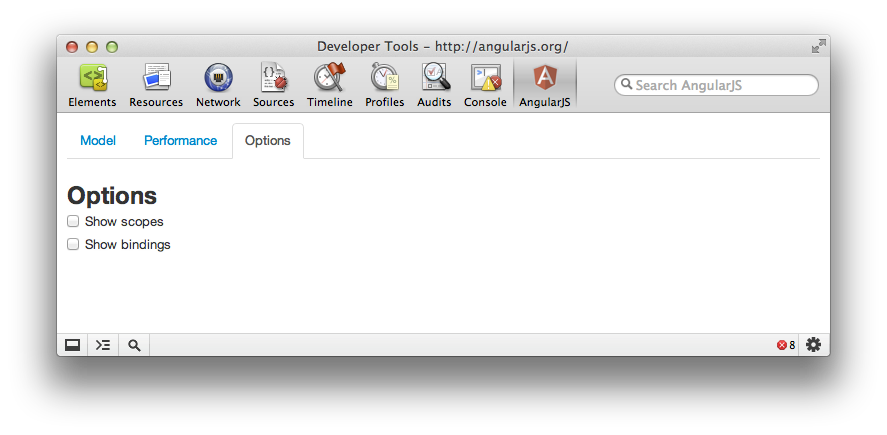

# AngularJS Batarang

## Getting it
Checkout my fork of AngularJS from Github:

    git clone git://github.com/btford/angular.js.git
    cd angular.js
    git fetch origin extension
    git checkout origin/extension

## Installation
You'll need [Google Chrome Canary](https://tools.google.com/dlpage/chromesxs) to use the extension.

1.  Navigate to `chrome://flags/` in Canary, and enable "Experimental Extension APIs"
2.  Navigate to `chrome://chrome/extensions/` and enable Developer Mode.
3.  On the same page, click "Load unpacked extension" and choose the "extension" directory inside the repository that you just checked out.

## Using the Batarang
First, navigate Chrome Canary to the AngularJS application that you want to debug. [Open the Developer Tools](https://developers.google.com/chrome-developer-tools/docs/overview#access). There should be an AngularJS icon. Click on it to open he AngularJS Batarang.

The Batarang has four tabs: Model, Performance, Options, and Help.

### Model

Starting at the top of this tab, there is the root selection. If the application has only one `ng-app` declaration (as most applications do) then you will not see the option to change roots.

Below that is a tree showing how scopes are nested, and which models are attached to them. Clicking on a scope name will take you to the Elements tab, and show you the DOM element associated with that scope. Models and methods attached to each scope are listed with bullet points on the tree. Just the name of methods attached to a scope are shown. Models with a simple value and complex objects are shown as JSON. You can edit either, and the changes will be reflected in the application being debugged.

### Performance

The performance tab must be enabled separately because it causes code to be injected into AngularJS to track and report performance metrics. There is also an option to output performance metrics to the console.

Below that is a tree of watched expressions, showing which expressions are attached to which scopes. Much like the model tree, you can collapse sections by clicking on "toggle" and you can inspect the element that a scope is attached to by clicking on the scope name.

Underneath that is a graph showing the relative performance of all of the application's expressions. This graph will update as you interact with the application.

### Options

Last, there is the options tab. The options tab has two checkboxes: one for "show scopes" and one for "show bindings." Each of these options, when enabled, highlights the respective feature of the application being debugged; scopes will have a red outline, and bindings will have a blue outline.

### Elements

The Batarang also hooks into some of the existing features of the Chrome developer tools. For AngularJS applications, there is now a properties pane on in the Elements tab. Much like the model tree in the AngularJS tab, you can use this to inspect the models attached to a given element's scope.

### Console

The Batarang exposes some convenient features to the Chrome developer tools console. To access the scope of an element selected in the Elements tab of the developer tools, in console, you can type `$scope`. If you change value of some model on `$scope` and want to have this change reflected in the running application, you need to call `$scope.$apply()` after making the change.